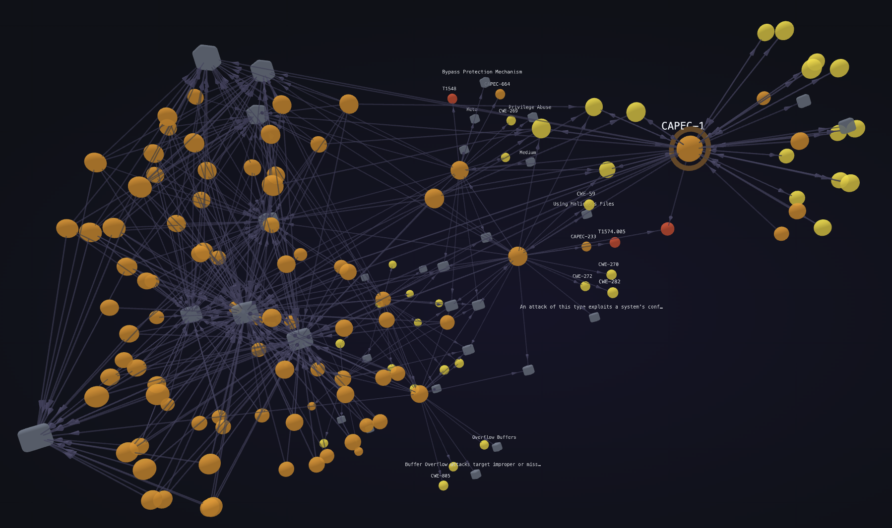
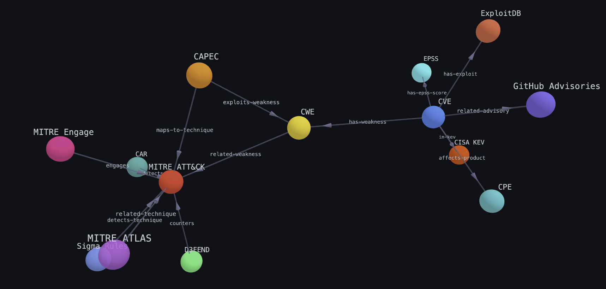

# Security Knowledge Graph Visualizer

**[Live App](https://s0ugata.github.io/security-kg-viz/)**

A fully static web app that lets you explore an **18M+ triple security knowledge graph** interactively in the browser. No backend required — data is queried on the fly from a Parquet file hosted on HuggingFace using [DuckDB-WASM](https://duckdb.org/docs/api/wasm/overview) and rendered as a 3D force-directed graph with [3d-force-graph](https://github.com/vasturiano/3d-force-graph) (Three.js).

<p align="center">
  
</p>

The knowledge graph aggregates data from 14 security data sources:

| Source | Description |
|--------|-------------|
| MITRE ATT&CK | Adversary tactics, techniques, and procedures |
| CAPEC | Common Attack Pattern Enumeration and Classification |
| CWE | Common Weakness Enumeration |
| CVE | Common Vulnerabilities and Exposures |
| CPE | Common Platform Enumeration |
| D3FEND | Countermeasure techniques |
| MITRE ATLAS | Adversarial ML threat matrix |
| CAR | Cyber Analytics Repository |
| MITRE Engage | Adversary engagement techniques |
| GitHub Advisories | GHSA security advisories |
| ExploitDB | Exploit database |
| EPSS | Exploit Prediction Scoring System |
| CISA KEV | Known Exploited Vulnerabilities catalog |
| Sigma Rules | Detection rule signatures |

Data source: [`s0u9ata/security-kg`](https://huggingface.co/datasets/s0u9ata/security-kg) on HuggingFace, built by the [`security-kg`](https://github.com/S0UGATA/security-kg) project.

## How It Works

```
Browser (static GitHub Pages)
  │
  ├─ DuckDB-WASM ──── HTTP range requests ───▶ HuggingFace Parquet (200MB)
  │    (SQL engine in WebAssembly)              (only fetches relevant row groups)
  │
  ├─ Graphology ────── graph data model
  │    + ForceAtlas2    (layout computation)
  │
  └─ Sigma.js ─────── WebGL rendering
       (up to ~500K nodes)
```

DuckDB-WASM queries the remote Parquet file using HTTP range requests — only the relevant row groups are downloaded (typically a few KB to MB per query), not the full 200MB file. Parquet's columnar format and row group metadata enable this efficient access pattern.

## Views

### Entity Explorer
Search for any entity ID (e.g., `T1059`, `CVE-2021-44228`, `CWE-79`) to visualize its 1-hop neighborhood as a force-directed graph. Click any node to drill down into its neighborhood. Drag nodes to rearrange, scroll to zoom, drag the background to pan.

### Dashboard
Overview statistics: total triple count, triples per source (bar chart), and top predicate distribution (horizontal bar chart). Loads pre-computed stats from `stats.json`, or queries DuckDB live as a fallback.

### Source Map
A static graph showing how the 14 data sources are interconnected (e.g., CAPEC maps to ATT&CK techniques, CVEs reference CWEs, D3FEND counters ATT&CK).

<p align="center">
  
</p>

### SQL Console
Run arbitrary SQL against the knowledge graph directly in the browser. The `kg` table has columns `subject`, `predicate`, `object`. Includes clickable example query presets.

## Getting Started

```bash
# Install dependencies
npm install

# Start dev server
npm run dev

# Production build
npm run build

# Preview production build
npm run preview
```

The first query will take a few seconds as DuckDB-WASM downloads its WebAssembly runtime from CDN and reads the Parquet metadata from HuggingFace. Subsequent queries are faster.

### Pre-computing Stats

The dashboard can use pre-computed statistics for instant load. To regenerate:

```bash
pip install duckdb
python scripts/generate-stats.py
```

This outputs `public/data/stats.json` by querying the HuggingFace Parquet file.

## Deployment

The project includes a GitHub Actions workflow (`.github/workflows/deploy.yml`) that:

1. Runs `generate-stats.py` to refresh dashboard statistics
2. Builds the Vite app with the correct base path
3. Deploys to GitHub Pages

Triggers: push to `main`, weekly on Mondays (to pick up upstream data updates), and manual dispatch.

## Tech Stack

| Layer | Technology |
|-------|-----------|
| Framework | React 19 |
| Build | Vite 6 |
| Language | TypeScript 5 (strict mode) |
| Graph rendering | Sigma.js 3 (WebGL) |
| Graph model | Graphology |
| Graph layout | ForceAtlas2 |
| Data queries | DuckDB-WASM |
| Charts | Chart.js + react-chartjs-2 |

All dependencies are MIT or Apache 2.0 licensed.

## License

This project is licensed under the [Apache License 2.0](LICENSE).

## Project Structure

```
src/
├── components/
│   ├── Dashboard.tsx        # Stats overview + Chart.js charts
│   ├── EntityExplorer.tsx   # Search → subgraph viewer (main view)
│   ├── GraphView.tsx        # Sigma.js wrapper with drag/zoom/click
│   ├── SearchBar.tsx        # Entity search with suggestion chips
│   ├── SourceMap.tsx        # 14-node source relationship graph
│   └── SqlConsole.tsx       # SQL editor + results table
├── lib/
│   ├── constants.ts         # Source colors, entity detection, example queries
│   ├── duckdb.ts            # DuckDB-WASM singleton, query helpers
│   └── graph-builder.ts     # Triples → Graphology graph + ForceAtlas2 layout
└── App.tsx                  # Tab layout + DuckDB status indicator

scripts/
└── generate-stats.py        # CI script: HuggingFace Parquet → stats.json
```
