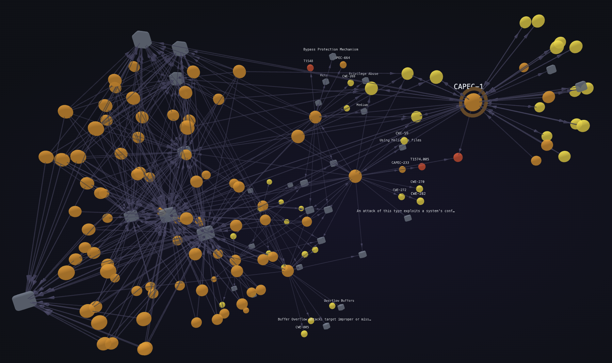
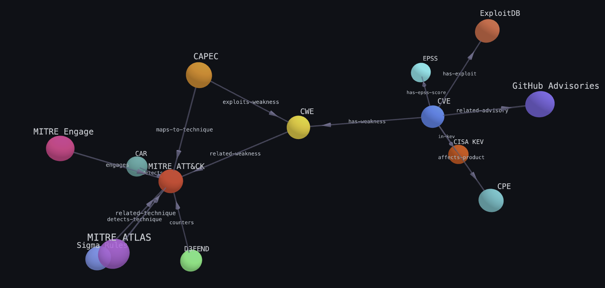

# Security Knowledge Graph Visualizer

**[Live App](https://s0ugata.github.io/security-kg-viz/)**

A fully static web app that lets you explore a **26M+ triple security knowledge graph** interactively in the browser. No backend required — data is queried on the fly from Parquet files hosted on HuggingFace using [DuckDB-WASM](https://duckdb.org/docs/api/wasm/overview) and rendered as a 3D force-directed graph with [3d-force-graph](https://github.com/vasturiano/3d-force-graph) (Three.js).

<p align="center">
  
</p>

The knowledge graph aggregates data from 24 security data sources:

| Source | Description |
|--------|-------------|
| MITRE ATT&CK | Adversary tactics, techniques, and procedures (Enterprise / Mobile / ICS) |
| CAPEC | Common Attack Pattern Enumeration and Classification |
| CWE | Common Weakness Enumeration |
| CVE | Common Vulnerabilities and Exposures |
| CPE | Common Platform Enumeration |
| D3FEND | Defensive countermeasure techniques |
| MITRE ATLAS | Adversarial ML threat matrix |
| CAR | Cyber Analytics Repository |
| MITRE Engage | Adversary engagement techniques |
| MITRE F3 | Fight Financial Fraud framework |
| GitHub Advisories | GHSA security advisories |
| ExploitDB | Exploit database |
| EPSS | Exploit Prediction Scoring System |
| CISA KEV | Known Exploited Vulnerabilities catalog |
| CISA Vulnrichment | Enriched CVE data (CVSS, CWE, SSVC) |
| Sigma Rules | Detection rule signatures |
| MISP Galaxy | Threat intel galaxies (actors, malware, tools) |
| Atomic Red Team | Adversary emulation tests mapped to ATT&CK |
| LOLBAS | Living Off The Land Binaries and Scripts |
| LOLDrivers | Living Off The Land vulnerable drivers |
| NIST 800-53 | Security controls → ATT&CK mappings |
| Nuclei Templates | Vulnerability scan templates |
| ENISA EUVD | EU Vulnerability Database (KEV-style catalog) |
| OSV | Open Source Vulnerabilities (npm, PyPI, Go, Maven, Debian, …) |

Data source: [`s0u9ata/security-kg`](https://huggingface.co/datasets/s0u9ata/security-kg) on HuggingFace, built by the [`security-kg`](https://github.com/S0UGATA/security-kg) project.

## How It Works

```
Browser (static GitHub Pages)
  │
  ├─ DuckDB-WASM ──── HTTP range requests ───▶ HuggingFace Parquet (per-source files)
  │    (SQL engine in WebAssembly)              (only fetches relevant row groups)
  │
  ├─ graph-builder.ts ── pure Triple[] → GraphData transform
  │                       (literal collapsing, source colouring)
  │
  └─ 3d-force-graph ──── Three.js / WebGL rendering
       (force-directed 3D layout, drill-down on click)
```

DuckDB-WASM queries the remote Parquet file using HTTP range requests — only the relevant row groups are downloaded (typically a few KB to MB per query), not the full files. Parquet's columnar format and row group metadata enable this efficient access pattern. The Data Source selector lets you scope queries to a single source (e.g. just `cve.parquet`) or query everything via `combined.parquet`.

## Views

### Entity Explorer
Search for any entity ID (e.g., `T1059`, `CVE-2021-44228`, `CWE-79`, `GHSA-...`, `EUVD-2024-37643`, `SI-4`) to visualize its multi-hop neighborhood. Configurable BFS / DFS traversal up to depth 10 with a triple limit. Click any node to drill down, drag nodes to rearrange, scroll to zoom, drag the background to orbit.

### Dashboard
Overview statistics: total triple count, triples per source (bar chart), source distribution (doughnut), top predicates, most connected entities, and top cross-source relationships. Loads pre-computed stats JSON from the HuggingFace dataset repo (`stats/<name>.stats.json`); falls back to phased live DuckDB queries if the stats file is missing.

### Source Map
A static graph showing how the 24 data sources are interconnected (e.g., CAPEC maps to ATT&CK techniques, CVEs reference CWEs, D3FEND counters ATT&CK, OSV aliases GHSA, NIST 800-53 mitigates ATT&CK, etc.). Edges discovered in the data are merged with a curated `KNOWN_LINKS` set in [src/lib/graph-builder.ts](src/lib/graph-builder.ts).

<p align="center">
  
</p>

### SQL Console
Run arbitrary SQL against the knowledge graph directly in the browser. The `kg` view has columns `subject`, `predicate`, `object`, `source`, `object_type`. Includes clickable example query presets.

## Getting Started

```bash
# Install dependencies
npm install

# Start dev server
npm run dev

# Production build
npm run build

# Preview production build
npm run preview
```

The first query will take a few seconds as DuckDB-WASM downloads its WebAssembly runtime from CDN and reads the Parquet metadata from HuggingFace. Subsequent queries are faster.

## Deployment

The project includes a GitHub Actions workflow ([.github/workflows/deploy.yml](.github/workflows/deploy.yml)) that builds the Vite app with the correct base path (`VITE_BASE_PATH=/<repo>/`) and publishes the `dist/` directory to GitHub Pages on push to `main` or via manual dispatch.

Pre-computed dashboard stats are **not** generated in this repo — the upstream [`s0u9ata/security-kg`](https://github.com/S0UGATA/security-kg) project generates `stats/<name>.stats.json` files and publishes them alongside the Parquet files on the HuggingFace dataset. The visualizer fetches them at runtime via `statsFileUrl(...)` in [src/lib/constants.ts](src/lib/constants.ts).

## Tech Stack

| Layer | Technology |
|-------|-----------|
| Framework | React 19 |
| Build | Vite 6 |
| Language | TypeScript 5 (strict mode) |
| Graph rendering | 3d-force-graph (Three.js / WebGL) |
| Data queries | DuckDB-WASM |
| Charts | Chart.js + react-chartjs-2 |

All dependencies are MIT or Apache 2.0 licensed.

## License

This project is licensed under the [Apache License 2.0](LICENSE).

## Project Structure

```
src/
├── components/
│   ├── About.tsx              # About panel
│   ├── Dashboard.tsx          # Stats overview + Chart.js charts
│   ├── DataSourceSelector.tsx # Switches the active parquet file
│   ├── EntityExplorer.tsx     # Search → multi-hop subgraph viewer (main view)
│   ├── GraphView.tsx          # 3d-force-graph wrapper (Three.js cleanup, label LOD)
│   ├── SearchBar.tsx          # Entity search with suggestion chips
│   ├── SourceMap.tsx          # Source-relationship graph
│   └── SqlConsole.tsx         # SQL editor + results table
├── lib/
│   ├── constants.ts           # Source colors / labels / detectSource / parquet list
│   ├── duckdb.ts              # DuckDB-WASM singleton, query + multi-hop helpers
│   └── graph-builder.ts       # Triples → GraphData + Source Map builder
├── App.tsx                    # Tab layout + DuckDB status indicator
└── main.tsx                   # React entry point
```
